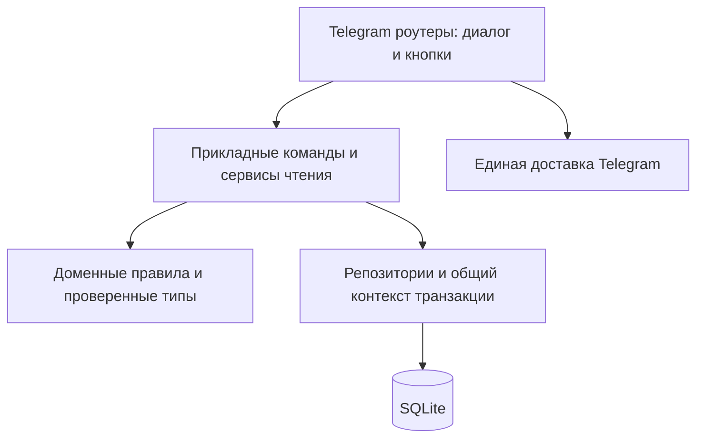

# Архитектурный аудит — 27 сентября 2026

Проверенный код: `e010a0eb92c534d06d764fb218e8f30cadb63cb0` (`codex/audit-hardening`). Аудит выполнен чтением кода и изолированными воспроизведениями на SQLite `:memory:` и моках Telegram. Рабочая `game.db` открывалась только через `sqlite3` в режиме `mode=ro`; код приложения, схема и данные не изменялись. Документ фиксирует открытые проблемы, а не выполненные исправления.

**Оценка.** Проекту полезен поэтапный рефакторинг в пределах одного приложения. Главная проблема — различающиеся гарантии сохранения и доставки в разных редакторах. Общая логика SQLite уже защищает транзакции, вложенные savepoint и отмену задач; снаряжение имеет долговечные черновики и контроль конфликтов. Эти механизмы стоит сохранить и распространить на остальные сценарии. Размер каталога сам по себе сейчас не требует перехода на другую БД или разделения на сервисы.

**Проверки и границы выводов.** Последний полный прогон на проверяемом коммите: 227 тестов, strict mypy для 31 модуля и Ruff — успешно. При этом новые воспроизведения ниже выявили сценарии, отсутствующие в этом наборе. Настоящие Telegram-запросы и нагрузочные проверки рабочего бота не выполнялись. Приведённые сетевые сбои моделировались; число SQL-запросов измерено на синтетическом каталоге, а не как задержка в эксплуатации.

Текущая база: `quick_check=ok`, `foreign_key_check` без нарушений, версия схемы 2. Каталог содержит 78 мобов, 127 ресурсов, 83 предмета снаряжения, 26 карт, 56 рецептов и 332 связи дропа. Не обнаружены осиротевшие дропы/результаты, пустые рецепты, владельцы без требования изучения, неверные количества и недопустимые типы/слоты/редкости. Не обнаружены совпадения resource name+type и card name+slot. Это проверка конкретных инвариантов; она не доказывает соответствие каждой записи игровым данным.

**Подтверждённые ошибки — исправлять до структурного переноса кода.** Все пункты ниже имеют приоритет P2: конкретное неправильное поведение при указанном сценарии. Первыми следует закрыть пункты 1–3, которые затрагивают записанные данные.

1. **Удаление из старого черновика пропускает изменения связанного свитка.** [database.py:1812](https://github.com/kombat-lab/database/blob/e010a0eb92c534d06d764fb218e8f30cadb63cb0/database.py#L1812). Удаление проверяет снаряжение и владельцев, но не поля самого свитка. Воспроизведение: открыть черновик снаряжения со свитком; другим редактором изменить имя/примечание ресурса свитка; выполнить из старого черновика удаление предмета вместе со свитком. Операция проходит, изменённый ресурс удаляется. Проверка ссылок есть при сохранении, но не покрывает этот путь удаления. Нужно фиксировать и сравнивать снимок именно удаляемых опубликованных объектов, включая свиток, его дроп и владельцев. Простого вызова проверки ссылок текущего черновика недостаточно: в нём уже мог быть выбран другой свиток или выключено изучение.

2. **Повтор старой кнопки дропа отменяет ранее выполненную операцию.** [admin_mobs.py:631](https://github.com/kombat-lab/database/blob/e010a0eb92c534d06d764fb218e8f30cadb63cb0/admin_mobs.py#L631), аналогично [admin_mobs.py:553](https://github.com/kombat-lab/database/blob/e010a0eb92c534d06d764fb218e8f30cadb63cb0/admin_mobs.py#L553). Сценарий через реальный admin_router: дропа нет → нажатие добавляет его → доставка новой клавиатуры падает → тот же callback повторяется и удаляет дроп. Наблюдаемый результат `False → True → False`. Нужна явная команда добавления/удаления с желаемым и при необходимости ожидаемым состоянием. Повтор уже принятой команды должен возвращать тот же результат, а не инвертировать актуальное состояние БД.

3. **Сбой Telegram после переименования моба оставляет активным ввод имени.** [admin_mobs.py:303](https://github.com/kombat-lab/database/blob/e010a0eb92c534d06d764fb218e8f30cadb63cb0/admin_mobs.py#L303). UPDATE выполняется до двух отправок; FSM завершается только после них. Воспроизведение через реальный admin_router: имя уже стало `Renamed`, первая отправка падает, состояние остаётся `MobStates:edit_new_value`; следующее сообщение `Спасибо` записывается как новое имя. После commit нужно сразу завершать состояние ввода, отдельно показывать результат и отдельно обрабатывать ошибку доставки.

4. **Можно отметить изучение рецепта, которому изучение не требуется.** [admin_gear.py:161](https://github.com/kombat-lab/database/blob/e010a0eb92c534d06d764fb218e8f30cadb63cb0/admin_gear.py#L161), [database.py:1385](https://github.com/kombat-lab/database/blob/e010a0eb92c534d06d764fb218e8f30cadb63cb0/database.py#L1385). Админское действие доступно для существующего gear-рецепта без свитка, а ручное добавление владельца проверяет только непустое имя. Воспроизведено `can_learn=False` при непустом списке владельцев; первая последующая привязка свитка сохраняет ошибочную отметку. Доменная команда должна проверять наличие learning requirement в одной транзакции, а UI — не предлагать действие без изучения. Для уже некорректной истории потребуется явное разрешение конфликта, без автоматического переноса отметок.

5. **Точное название может отсутствовать в поиске.** [database.py:682](https://github.com/kombat-lab/database/blob/e010a0eb92c534d06d764fb218e8f30cadb63cb0/database.py#L682), [search_rendering.py:46](https://github.com/kombat-lab/database/blob/e010a0eb92c534d06d764fb218e8f30cadb63cb0/search_rendering.py#L46). SQL сначала выбирает первые 50 совпадений по ID, а ранжирование происходит уже после ограничения. Создание 50 ресурсов `Ore variant ...` и затем `Ore` приводит к отсутствию точного `Ore` в поиске `Ore`; следующая inline-страница пустая. Приоритет точного совпадения/префикса должен вычисляться до LIMIT, с общим стабильным порядком и согласованной пагинацией.

6. **Личная отметка изучения отображается как состояние общей групповой карточки.** [bot.py:1182](https://github.com/kombat-lab/database/blob/e010a0eb92c534d06d764fb218e8f30cadb63cb0/bot.py#L1182). Игрок 101 уже изучил рецепт, поэтому общее сообщение содержит кнопку снятия отметки. Игрок 202 нажимает её и получает сообщение об удалении отметки, хотя своей отметки у него не было. Чужую запись это не удаляет, но действие и подпись не отражают состояние нажавшего. В группе нужен переход к персональному управлению либо независимые явные команды добавить/снять отметку, не зависящие от последнего открывшего общую карточку.

7. **Отправка карты мира обходит общую политику доставки.** [bot.py:741](https://github.com/kombat-lab/database/blob/e010a0eb92c534d06d764fb218e8f30cadb63cb0/bot.py#L741). Подтверждены две отдельные ошибки: входное сообщение из темы 72 не передаёт `message_thread_id` в rich-отправку; после смоделированного неоднозначного `TelegramNetworkError` выполняется вторая, текстовая отправка. Первая могла уже быть принята Telegram, поэтому возможен дубль. Общие функции доставки в проекте уже учитывают эти ситуации; карта мира должна использовать ту же политику: сохранять тему, делать fallback только после однозначного отказа в формате.

**Архитектурные ограничения — это отдельная категория, не доказательство текущей аварии.**

- **Смешанные ответственности и глобальные зависимости.** `database.py`: 2217 строк, 121 функция/метод, одновременно подключение, миграции, CRUD, доменные операции, черновики и аналитика. `bot.py`: 1536 строк, 74 функции, одновременно bootstrap, роутеры, карточки, навигация и аналитика. В обработчиках и редакторах остаются прямые SQL-запросы. Импорт глобального `db`, глобальные роутеры и Dispatcher усложняют независимые тесты: фикстуры вынуждены заменять зависимости в нескольких модулях. Разделять следует по ответственности и сценариям, сохраняя общий транзакционный контекст.
- **Strict mypy не закрывает динамические границы.** [admin_contracts.py:11](https://github.com/kombat-lab/database/blob/e010a0eb92c534d06d764fb218e8f30cadb63cb0/admin_contracts.py#L11) содержит `EntityRow = Mapping[str, Any]`, `StateData = dict[str, Any]` и `UpdateEntity = Callable[..., Awaitable[None]]`. `DbRow` также динамический. Не все ошибки ключей и аргументов проверяются статически. На SQL/FSM-входе нужна явная проверка данных, далее — конкретные команды и результаты; разные виды предметов и операций должны иметь узкие контракты. Штатный generic UI сейчас валидирует поля, поэтому отдельный баг ввода произвольного слота здесь не заявляется.
- **Разные жизненные циклы редактирования.** Снаряжение хранит черновик в SQLite; создание ресурсов, карт, мобов и алхимии использует память FSM. Перезапуск теряет незавершённый ввод этих сценариев. Нужны единые правила публикации/отмены/возобновления; долговечный черновик полезен многошаговым формам, а одиночное изменение поля может оставаться короткой атомарной командой.
- **Разные правила идентичности.** Обычное создание ресурса допускает повтор имени и типа, встроенное создание материала в снаряжении запрещает совпадение имени. Это воспроизведено, но одинаковые названия не всегда означают ошибку. Нужны общий поиск совпадений, предложение выбрать существующее и явное создание варианта; запрещать все совпадения одним UNIQUE по имени без продуктового правила нельзя.
- **Лишняя работа в inline-поиске.** [bot.py:832](https://github.com/kombat-lab/database/blob/e010a0eb92c534d06d764fb218e8f30cadb63cb0/bot.py#L832): до 50 полных карточек строятся последовательно на запрос; кеш Telegram отключён. На 50 простых ресурсах измерено 154 SQL-вызова на страницу: 4 для поиска и 3 на каждый результат. Debounce применяется только к записи аналитики. Полезны пакетная загрузка карточек, ограниченный кеш с инвалидированием после изменений и прекращение работы над устаревшим запросом. Простое распараллеливание запросов через gather не решает проблему одного соединения.
- **Каталог и аналитика используют общую очередь SQLite.** [database.py:162](https://github.com/kombat-lab/database/blob/e010a0eb92c534d06d764fb218e8f30cadb63cb0/database.py#L162), [analytics.py:258](https://github.com/kombat-lab/database/blob/e010a0eb92c534d06d764fb218e8f30cadb63cb0/analytics.py#L258): общий lock сериализует запросы. Страница пользователей сначала агрегирует события для всех пользователей и сортирует, затем применяет LIMIT. На текущих 32 пользователях и 4306 событиях задержка не доказана. Сначала нужны метрики длительности и числа SQL, оптимизация запросов и ограничение истории; отдельное соединение чтения/очередь аналитики — по результатам измерений, без ослабления атомарности записей.
- **Память FSM не ограничена временем жизни.** [bot.py:201](https://github.com/kombat-lab/database/blob/e010a0eb92c534d06d764fb218e8f30cadb63cb0/bot.py#L201) использует MemoryStorage по умолчанию и SimpleEventIsolation. В установленном aiogram 3.31.0 после создания и очистки 1000 синтетических сессий остаются 1000 пустых записей и 1000 неиспользуемых locks. Это накопление с количеством уникальных контекстов за жизнь процесса, не измеренный OOM. Нужна ограниченная политика хранения; удаление locks обязано учитывать ожидающие/активные задачи.
- **Неявная семантика данных.** Иерархия леса/пещер задаётся ID `4/8/9/10` в `bot.py:154`, специальный ресурс — ID `71` в `ui/cards.py:369`. Текущий снимок согласован, но перенос/пересоздание данных зависит от этих чисел. Предпочтительны устойчивый код ресурса и явные связи родительских локаций. Также имеются параллельные старые и новые форматы callback: их совместимость лучше изолировать в одном адаптере.
- **Нет общего журнала административных изменений.** Аналитика посещений не заменяет запись того, кто, когда и что поменял в каталоге. Черновик снаряжения покрывает часть истории, но ресурс/моб/карта не имеют единого before/after-журнала. Для исправления ошибочных правок полезно записывать автора, идентификатор операции, затронутые объекты и изменения в одной транзакции. Автоматический откат не должен перетирать последующие правки.

**Целевая структура.** Оставить одно приложение и SQLite, выделив зависимости явно:

`app` собирает конфигурацию и зависимости при запуске; `domain` содержит правила без aiogram и SQL; `application` — создание/изменение/удаление/изучение и результаты операций; `infrastructure` — SQLite, миграции, журнал и хранение черновиков; `telegram` — роутеры и представление. Это границы ответственности, а не требование немедленно создать все эти папки или перенести весь код одним коммитом. Существующий Database можно временно оставить фасадом для совместимости.

**Порядок работ и критерии готовности.**

1. Добавить регрессионные тесты для семи пунктов, затем исправить команды удаления, дропа, мобов и изучения, поиск и отправку карты. Проверять отказ до записи, успех commit при ошибке Telegram, повтор того же действия и конкурирующее изменение. Число зелёных тестов само по себе не заменяет эти сценарии.
2. Выделить прикладные команды сначала для мобов и источников дропа: проверенный ввод → короткая транзакция/контроль версии → результат → доставка. Перевести старый mob-side редактор и новый item-side редактор на общие правила сохранения. Внедрять зависимости при сборке приложения, переносить валидацию к командам; оставить совместимые адаптеры к старым кнопкам.
3. Разделить Database на инфраструктуру транзакций/миграций и репозитории по ответственности, не открывая независимую транзакцию в каждом репозитории. Затем разделить публичный bot.py на небольшие роутеры и сервис чтения каталога. После каждого небольшого переноса сохранять полный набор проверок на Windows/Linux.
4. Выравнять многошаговые черновики, добавить журнал правок и единое правило совпадений. Исправить SQL-ранжирование и пакетную загрузку inline-карточек, измерить стоимость аналитики. Ограничить срок жизни FSM/завершённых черновиков/аналитической истории по назначению данных. Подтверждать ускорение числом SQL и замерами p50/p95, а не только уменьшением строк кода.

Для миграций данных: отдельный коммит, согласованный снимок SQLite, проверка целостности и обратимый план восстановления. Готовые текущие механизмы транзакций, защиты рецептов, сохранения старых ID и доставки больших карточек следует сохранить; менять их только с отдельным воспроизводящим основанием.
