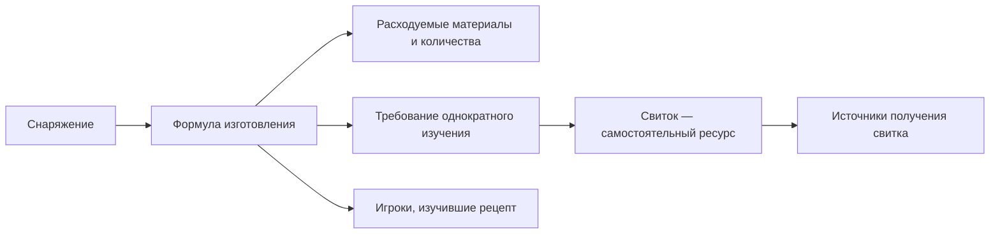

Исходный аудит до исправлений. Ссылки на код привязаны к проверенному коммиту. Результаты последующей реализации и переноса рабочей базы описаны в [IMPLEMENTATION_2026-09-20.md](E:/fog_database/IMPLEMENTATION_2026-09-20.md).

Аудит проекта Fog Database от 20 сентября 2026 года. Фокус: административное меню, добавление оружия/снаряжения, изучаемые рецепты и качество актуального каталога.

Главный вывод: администратор вручную собирает связанные части одного игрового объекта в нескольких разделах. Дополнительно текущая модель считает изучаемый свиток ингредиентом крафта. Пользователь подтвердил, что свиток изучается один раз. Поэтому упрощение должно охватывать модель данных, создание связанных записей, карточки и редактирование.

Проверен локальный код `codex/audit-hardening`, коммит `6c4d846`. `origin/main` находится на `41afef6`: в нём 11 отдельных коммитов рефакторинга, а локальный коммит аудита в него не включён. Ключевые проблемы создания снаряжения и рецептов сверены также с `origin/main`: разнесение админки по `admin_mobs.py`/`admin_recipes.py` их не устранило. Автотесты и проверки типов ниже относятся к текущей локальной ветке. Работающий экземпляр Telegram-бота не подключался.

Исходная база `game.db` открывалась SQLite в режиме `mode=ro` только для создания согласованного снимка через backup API, включая зафиксированные WAL-данные. Снимок: [game-before-audit-20260920T112147Z.db](E:/fog_database/backups/audit/game-before-audit-20260920T112147Z.db). Все дальнейшие проверки выполнялись на снимке или одноразовых копиях. Код приложения и исходная база при этом аудите не изменялись.

Проверенные факты о каталоге:

| Объекты | Количество |
| --- | ---: |
| Снаряжение | 84 |
| Ресурсы | 127 |
| Рецепты изготовления снаряжения | 44 |
| Рецепты алхимических ресурсов | 12 |
| Свитки изучения | 21 |
| Строки ингредиентов в текущей модели | 245 |
| Связи дропа | 332 |
| Записи владельцев рецептов | 40 |

`integrity_check=ok`, `foreign_key_check` без ошибок. Дополнительно проверены полиморфные ссылки, которые SQLite FK не покрывает: результаты рецептов и предметы дропа. Не найдены потерянные ссылки, пустые рецепты, повторные результаты рецептов, самоингредиенты, циклы, недопустимые типы/количества/уровни. Все 21 свиток используются ровно в одном рецепте снаряжения, в количестве 1. Все эти предметы имеют редкость `epic` — в пользовательских обозначениях «Сверхредкое».

1. **P1 — изучение рецепта представлено как расход материала при каждом изготовлении.**

   В `recipe_ingredients` находятся 21 строка со свитками типа `scroll_recipe`. Карточка снаряжения выводит их вместе с материалами под заголовком «Требуемые ресурсы», с количеством `1 шт.`. Источники свитка тоже вычисляются через этот список. Это расходится с подтверждённой механикой однократного изучения. Опорные места: [database.py:994](https://github.com/kombat-lab/database/blob/6c4d846c21bd6d0e353f861460a432ae55d93d69/database.py#L994), [bot.py:518](https://github.com/kombat-lab/database/blob/6c4d846c21bd6d0e353f861460a432ae55d93d69/bot.py#L518), [bot.py:589](https://github.com/kombat-lab/database/blob/6c4d846c21bd6d0e353f861460a432ae55d93d69/bot.py#L589).

   Исправление: сохранить свиток отдельным ресурсом для дропа, поиска и собственной карточки, а его роль перенести в явную связь «для изготовления нужно изучить этот свиток». Расходуемые ингредиенты должны содержать только то, что тратится на одну операцию изготовления. Интерфейс владельцев следует назвать «Кто изучил рецепт».

2. **P1 — старая кнопка редактирования может изменить другой объект.**

   Воспроизведено через настоящий `admin_router.propagate_event`: открыта карточка ресурса A в сообщении 10; вызван `/kombat`; открыта карточка B в сообщении 30; нажата старая кнопка A `edit_field_name`; введено новое имя. Обработчик вызвал обновление B. Кнопка передаёт только поле, а ID объекта берётся из текущего FSM. В приглашении к вводу название объекта отсутствует. Telegram и запись в БД в этом воспроизведении были подменены, реальные фильтры роутера и FSM работали.

   Опорные места: [admin_utils.py:208](https://github.com/kombat-lab/database/blob/6c4d846c21bd6d0e353f861460a432ae55d93d69/admin_utils.py#L208), [admin_utils.py:256](https://github.com/kombat-lab/database/blob/6c4d846c21bd6d0e353f861460a432ae55d93d69/admin_utils.py#L256), [admin_utils.py:403](https://github.com/kombat-lab/database/blob/6c4d846c21bd6d0e353f861460a432ae55d93d69/admin_utils.py#L403), [admin_utils.py:434](https://github.com/kombat-lab/database/blob/6c4d846c21bd6d0e353f861460a432ae55d93d69/admin_utils.py#L434), [admin_handlers.py:89](https://github.com/kombat-lab/database/blob/6c4d846c21bd6d0e353f861460a432ae55d93d69/admin_handlers.py#L89). В `main` тот же механизм сохранён в `admin_utils.py`.

   Каждое изменяющее действие должно проверять идентификатор сессии редактирования, объект, сообщение и актуальную версию черновика. В приглашении должно быть видно, какое поле какого предмета меняется. Существующая защита подтверждения удаления полезна, но этот сценарий редактирования она не охватывает.

3. **P2 — создание снаряжения обрывается перед настройкой его крафта.**

   `GearAddStates` проводит пользователя через семь этапов: название, редкость, слот, эмодзи, уровень, классы, примечание. Затем `save_new_gear()` сохраняет запись и возвращает в корень админки. Возвращённый БД ID нового предмета не используется для открытия его редактора. В редакторе снаряжения нет переходов к составу изготовления, изучаемому свитку или источникам. Затем приходится создавать ресурс свитка в другом разделе, искать предмет заново в разделе рецептов и вручную добавлять связи. Опорные места: [admin_handlers.py:164](https://github.com/kombat-lab/database/blob/6c4d846c21bd6d0e353f861460a432ae55d93d69/admin_handlers.py#L164), [admin_handlers.py:400](https://github.com/kombat-lab/database/blob/6c4d846c21bd6d0e353f861460a432ae55d93d69/admin_handlers.py#L400), [admin_handlers.py:532](https://github.com/kombat-lab/database/blob/6c4d846c21bd6d0e353f861460a432ae55d93d69/admin_handlers.py#L532), [admin_handlers.py:1645](https://github.com/kombat-lab/database/blob/6c4d846c21bd6d0e353f861460a432ae55d93d69/admin_handlers.py#L1645).

   Разные записи нужны для разных игровых понятий. Их создание и связывание должен выполнять один мастер. Создание самого предмета должно завершаться его административной карточкой с кнопками дальнейшей настройки.

4. **P2 — выбор результатов и материалов плохо работает уже на текущем объёме данных.**

   При добавлении рецепта результат выбирается одной клавиатурой без поиска, фильтров, пагинации и кнопки возврата. В актуальном каталоге доступны 40 предметов снаряжения и 115 ресурсов без собственного рецепта. Ветка «Алхимия» предлагает все типы ресурсов, включая свитки, хотя все 12 существующих ресурсных рецептов относятся именно к алхимии. Имена в выборе результата не сопровождаются уровнем/слотом, что затрудняет различение одноимённых предметов. [admin_handlers.py:1484](https://github.com/kombat-lab/database/blob/6c4d846c21bd6d0e353f861460a432ae55d93d69/admin_handlers.py#L1484), [admin_handlers.py:1645](https://github.com/kombat-lab/database/blob/6c4d846c21bd6d0e353f861460a432ae55d93d69/admin_handlers.py#L1645).

   Ингредиенты выбираются по 10 из общего списка 127 ресурсов: до 13 страниц, без поиска и добавления недостающего материала на месте. Для «Костяного криса» в начальном общем списке «Костяной куб» находится на странице 3, «Прочная бечевка» — 7, свиток — 8. [admin_handlers.py:1680](https://github.com/kombat-lab/database/blob/6c4d846c21bd6d0e353f861460a432ae55d93d69/admin_handlers.py#L1680), [admin_handlers.py:1697](https://github.com/kombat-lab/database/blob/6c4d846c21bd6d0e353f861460a432ae55d93d69/admin_handlers.py#L1697).

   Нужны поиск с различимыми результатами, фильтры, сохранение текущего контекста и добавление материала из редактора состава. Полезен ввод нескольких строк материалов за один раз с предпросмотром распознанных позиций и явным разрешением неоднозначных названий.

5. **P2 — нет отдельного черновика и атомарного завершения пользовательской операции.**

   Выбор результата немедленно создаёт пустой рецепт в рабочем каталоге. `get_gear_card()` сразу считает предмет крафтящимся по факту существования `recipe_id`, даже когда ингредиентов нет. Это воспроизведено на временной БД: `craftable=True`, ингредиентов 0. В текущем снимке пустых рецептов нет, но интерфейс позволяет их оставить. [admin_handlers.py:1664](https://github.com/kombat-lab/database/blob/6c4d846c21bd6d0e353f861460a432ae55d93d69/admin_handlers.py#L1664), [database.py:1043](https://github.com/kombat-lab/database/blob/6c4d846c21bd6d0e353f861460a432ae55d93d69/database.py#L1043).

   У мастера снаряжения нет общей кнопки «Назад на шаг», предпросмотра и возобновляемого черновика. Ошибка самого `add_gear()` приводит к очистке FSM и потере введённых значений. Данные FSM находятся в памяти процесса. Черновик нужно сохранять отдельно от опубликованного каталога. Финальное «Сохранить» должно выполнять короткую транзакцию создания/обновления всего набора объектов. Держать SQLite-транзакцию открытой, пока администратор отвечает на вопросы, нельзя.

6. **P2 — сбой Telegram после сохранения может создать дубль.**

   INSERT и уведомление об успехе находятся в одном `try`, завершение FSM выполняется позже. На `:memory:` воспроизведено: предмет сохранён; два ответа Telegram завершились `TelegramNetworkError`; состояние осталось `GearAddStates.note`; повтор заметки создал второй предмет, число записей выросло с 1 до 2. Аналогичный шаблон есть в создании карт. [admin_handlers.py:532](https://github.com/kombat-lab/database/blob/6c4d846c21bd6d0e353f861460a432ae55d93d69/admin_handlers.py#L532), [admin_handlers.py:629](https://github.com/kombat-lab/database/blob/6c4d846c21bd6d0e353f861460a432ae55d93d69/admin_handlers.py#L629).

   После успешного commit результат операции и созданный ID должны быть зафиксированы независимо от уведомления. Повтор того же сохранения должен возвращать уже созданный объект. Ошибка доставки должна позволять повторно показать результат, а ошибка БД — продолжить работу с сохранённым черновиком.

7. **P2 — удаление ресурса молча меняет состав других рецептов.**

   `delete_resource()` удаляет все строки ингредиентов с этим ресурсом. Подтверждение сообщает только об удалении самого ресурса. При удалении синтетического свитка ингредиенты сократились с 2 до 1, источники свитка — с 1 до 0, а рецепт сохранил прежний ID и `craftable=True`. В актуальной базе ресурс «Пыль» ID 71 участвует в 45 рецептах: масштаб последствий может быть большим. [database.py:828](https://github.com/kombat-lab/database/blob/6c4d846c21bd6d0e353f861460a432ae55d93d69/database.py#L828), [admin_utils.py:487](https://github.com/kombat-lab/database/blob/6c4d846c21bd6d0e353f861460a432ae55d93d69/admin_utils.py#L487).

   Перед удалением нужен просмотр зависимостей. Для используемого ресурса предпочтительны архивирование, исправление или объединение с заменой ссылок; удаление с изменением других рецептов должно быть отдельным явным действием. При объединении дублей следует сохранять разрешение старых ID, чтобы опубликованные ссылки продолжали работать.

8. **P3 — редактор допускает рецепт, использующий собственный результат.**

   Список ингредиентов ресурсного рецепта не исключает сам результирующий ресурс. `add_ingredient()` проверяет наличие записей и повтор ингредиента, но не такую зависимость. На временной БД сохранён результат, требующий две единицы самого себя. В исходных данных таких рецептов и циклов не найдено. [admin_handlers.py:1689](https://github.com/kombat-lab/database/blob/6c4d846c21bd6d0e353f861460a432ae55d93d69/admin_handlers.py#L1689), [database.py:1164](https://github.com/kombat-lab/database/blob/6c4d846c21bd6d0e353f861460a432ae55d93d69/database.py#L1164).

   Проверки должны выполняться в доменном слое сохранения, чтобы действовать также для импорта и будущего редактора. Самозависимость нужно отклонять; циклы между промежуточными материалами выявлять и требовать явной проверки механики преобразования. Строгая статическая типизация сама по себе этих правил не обеспечивает.

9. **P2 — длинные административные карточки не защищены так же, как публичные.**

   Два допустимых имени ингредиентов по 2100 ASCII-символов дали административный экран длиной 4332 видимых символа. Обновление количества уже сохранилось, но транспорт, проверяющий лимит Telegram, отклонил экран; FSM остался в режиме ввода количества. Это искусственно длинные данные, а не обнаруженная испорченная текущая запись. Обычный `sendMessage` допускает до 4096 символов после разбора разметки. [Telegram Bot API](https://core.telegram.org/bots/api#sendmessage).

   Источники: [admin_handlers.py:1621](https://github.com/kombat-lab/database/blob/6c4d846c21bd6d0e353f861460a432ae55d93d69/admin_handlers.py#L1621), [admin_handlers.py:1772](https://github.com/kombat-lab/database/blob/6c4d846c21bd6d0e353f861460a432ae55d93d69/admin_handlers.py#L1772), [admin_utils.py:54](https://github.com/kombat-lab/database/blob/6c4d846c21bd6d0e353f861460a432ae55d93d69/admin_utils.py#L54). Нужны разумные ограничения отдельных полей, ограниченный по размеру/постраничный административный экран и корректное состояние после сохранения даже при ошибке его показа.

10. **P3 — важные игровые свойства зашиты в представление.**

   Самоотметка об изученном рецепте доступна по условию `rarity == 'epic'`, а не по явному наличию изучаемого рецепта. Сегодня все 21 свиток относятся к этой редкости, поэтому нарушения текущих данных здесь нет. Это ограничение модели на будущее и риск при изменении редкости администратором. [bot.py:1347](https://github.com/kombat-lab/database/blob/6c4d846c21bd6d0e353f861460a432ae55d93d69/bot.py#L1347), [database.py:1234](https://github.com/kombat-lab/database/blob/6c4d846c21bd6d0e353f861460a432ae55d93d69/database.py#L1234).

   Место алхимического крафта также выбирается из жёстко заданного набора названий ресурсов, иначе применяется общий адрес. Переименование не должно менять игровое свойство. [bot.py:88](https://github.com/kombat-lab/database/blob/6c4d846c21bd6d0e353f861460a432ae55d93d69/bot.py#L88), [bot.py:114](https://github.com/kombat-lab/database/blob/6c4d846c21bd6d0e353f861460a432ae55d93d69/bot.py#L114). Эти свойства следует хранить и редактировать явно. В форме редкости и подсказках полей внутренние ключи вроде `epic`/`name` следует заменить понятными пользовательскими названиями.

По актуальным данным требуется следующая работа:

| Запись | Что установлено | Предлагаемое действие |
| --- | --- | --- |
| Все 21 `scroll_recipe` в ингредиентах | Однозначные связи, количество 1; пользователь подтвердил однократное изучение | Перенести в связь изучения вместе с обновлением кода; сами ресурсы и дроп сохранить |
| Gear 61 и 75 — «Чешуйчатый нагрудник» | Одинаковые имя, редкость, слот, уровень 10, классы и примечание; отличаются эмодзи. У 61 нет каталоговых связей, у 75 рецепт 46 | Сильный кандидат на объединение в 75 с сохранением старого ID через перенаправление; в ходе аудита не удалён |
| Gear 48 и 62 — «Плащ из плотной ткани» | Разные уровни 1 и 10 | Сохранять как варианты; показывать уровень в выборе |
| Resource 138 — «Рецепт (Костяной крис)» | Корректно связан с recipe 56 и gear 86; источник дропа не указан | Пометить источник как незаполненный, дополнить по игровым данным; отсутствие дропа не доказывает отсутствие другого способа получения |
| 10 ресурсов без каталоговых связей | Среди них расходники, товары, материалы; есть содержательные примечания | Не удалять по одному признаку отсутствия связей |
| Resource 68 | Историческое двойное имя «Сверкающий посох/Жезл туманного мага», связь с gear 39 корректна | Сохранить альтернативное название до проверки игрового источника |

Доказанного мусора для безусловного удаления не обнаружено. Дубликат названия не является достаточным правилом удаления: в этой базе есть реальные варианты по уровню. Проверка «нет связей» тоже не подходит для всего каталога.

Предлагаемый основной сценарий: **«Добавить снаряжение» создаёт одну законченную карточку со всеми необходимыми связями.**

1. Ввести название и основные параметры. Слот подставляется из выбранного раздела, эмодзи и необязательные поля получают подходящие значения по умолчанию. Назад на шаг и сохранение черновика доступны постоянно. На совпадающее имя показываются существующие предметы с уровнем, редкостью и слотом; вариант другого уровня допускается осознанно.
2. Указать способы получения: готовый дроп, изготовление или пока не заполнено. Готовый дроп и изготовление могут быть независимыми свойствами. Отсутствие данных следует отличать от утверждения «крафта нет».
3. Для изготовления набрать расходуемые материалы поиском или списком строк, проверить распознанные позиции и количества. Недостающий материал можно добавить прямо здесь с возвратом в текущий черновик.
4. Указать «Нужно изучить рецепт». Выбрать существующий свиток или создать его автоматически с предложенным названием. В этом же контексте указать источники свитка. Отдельный рецепт изготовления свитка создавать не требуется. При неизвестном источнике черновик/карточка явно показывает пробел.
5. Просмотреть итоговую карточку и сохранить. После сохранения открывается именно этот предмет: «Параметры», «Состав крафта», «Изучаемый свиток», «Источники», «Кто изучил», «Создать похожий».

На конкретном примере итоговое представление должно выглядеть так:

```text
⚔️ Костяной крис · уровень 10 · Тень

Для изготовления одной штуки:
  Костяной куб ×1
  Прочная бечевка ×1
  Хитиновые шипы ×10

Перед первым изготовлением:
  Изучить «Рецепт (Костяной крис)»
  Повторное изучение для каждого крафта не требуется.

Источник свитка: пока не указан.
```

Разделение понятий и связей:



На уровне реализации достаточно сохранить каталог снаряжения, ресурсов и формул, добавив явную связь изучения. Для текущих данных подходит связь `recipe_id → scroll_resource_id` с FK и ограничением единственности. Тип свитка, допустимый тип результата и совместимость связи проверяются при сохранении агрегата. Количество у связи изучения не нужно: это условие доступа, а расход задаётся исключительно в ингредиентах.

Мастер должен работать с типизированным черновиком и сохранять его отдельно от опубликованных записей. Долгая работа пользователя не должна держать транзакцию БД. Финальная операция получает уникальный идентификатор сохранения, проверяет версии/дубликаты/зависимости и записывает снаряжение, свиток, формулу и связи короткой транзакцией. Повторный callback возвращает результат той же операции. Старые сообщения не могут применить действия к новому черновику. Сохранённый результат и доставка Telegram-уведомления обрабатываются раздельно.

Миграция проверена экспериментально на отдельной временной БД. Сначала штатная миграция текущего кода `user_version 0 → 1` сохранила все значения каталога и 40 старых ручных записей владельцев. Затем 21 связь свитка была перенесена SQL-моделью в отдельную таблицу изучения. Получилось:

| Проверка после пробного переноса | Результат |
| --- | ---: |
| Расходуемые ингредиенты | 224 |
| Связи изучения | 21 |
| Рецепты снаряжения / алхимии | 44 / 12 |
| Записи владельцев | 40 |
| Связи дропа | 332, сохранены |
| Пустые рецепты | 0 |
| Целостность / FK | ok / без ошибок |

Все исходные пары «рецепт–свиток» и значения остальных записей сохранились. SHA256 исходного резервного снимка до и после проверки совпал. Это доказательство возможности переноса данных, а не готовая выпущенная миграция: рабочий код пока зависит от свитков в ингредиентах. Простое удаление этих 21 строк из `game.db` сейчас сломало бы отображение связей и источников.

Рекомендуемая последовательность реализации:

1. Свести изменения `main` и `codex/audit-hardening` в одну основу, сохранив новую навигацию и исправления надёжности. Нельзя заменять одну ветку другой вслепую.
2. Закрыть редактирование чужого текущего объекта через старые кнопки, повторное создание после ошибки доставки и неявное изменение зависимых рецептов при удалении.
3. Добавить модель изучения и совместимые административные/публичные представления; оформить версионированную миграцию 21 связи и проверить её на копии базы.
4. Заменить разрозненное создание единым мастером и редактором с поиском материалов, контекстом, черновиком и предпросмотром.
5. Добавить управление качеством каталога: кандидаты на дубли, незаполненные источники, незавершённый крафт, безопасное объединение/архивирование с сохранением ссылок.

Критерии приёмки: создать оружие со свитком и формулой без выхода из одного мастера; отменить/возобновить черновик без публикации пустого рецепта; пережить повтор callback и ошибку Telegram без второго INSERT; отклонить старую кнопку A при редактировании B; показывать свиток отдельно от расходуемых материалов; сохранять старые ссылки при объединении; не менять чужие рецепты неявным удалением материала; сохранить все 40 владельцев и дроп при миграции.

Текущие проверки прошли: **117 тестов, strict mypy для 17 исходных модулей, Ruff**. Это хороший фундамент, но текущие тесты в основном подменяют административную доставку и не проверяют законченный сценарий создания оружия со свитком, транспортные ошибки после commit и семантику изучения. Подтверждённые выше сценарии воспроизводились отдельно на `:memory:` и через реальные фильтры роутера с подменой внешних вызовов. Результат означает отсутствие найденных ошибок в выполненных проверках, а не полную корректность продукта.

Машиночитаемые данные, все 21 связь свитков, цепочки всех 84 предметов и результаты пробного переноса сохранены в [audit_data_20260920.json](E:/fog_database/audit_data_20260920.json). В JSON включён каталог; профили пользователей, имена владельцев и история аналитики исключены. Рабочая БД, код приложения и удалённые ветки в ходе аудита не изменялись.
